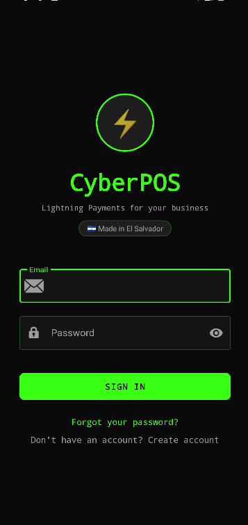
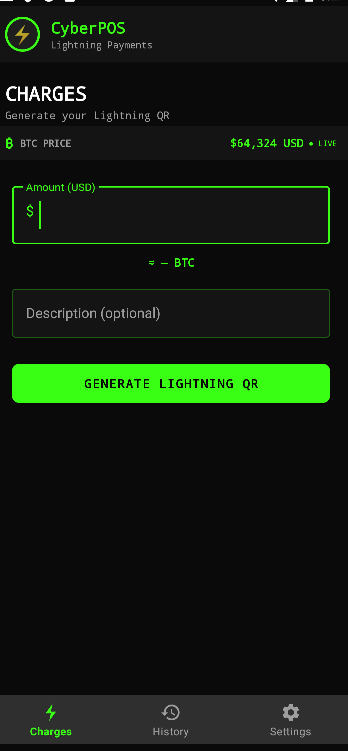
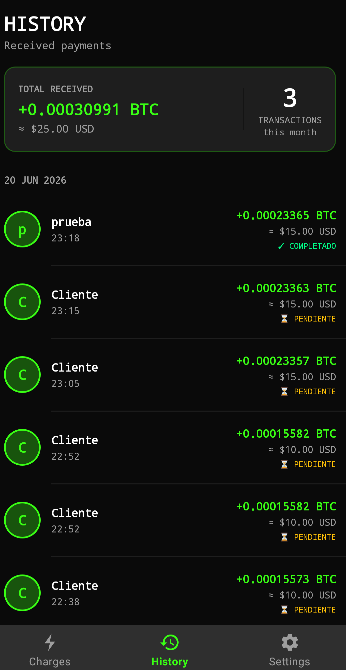
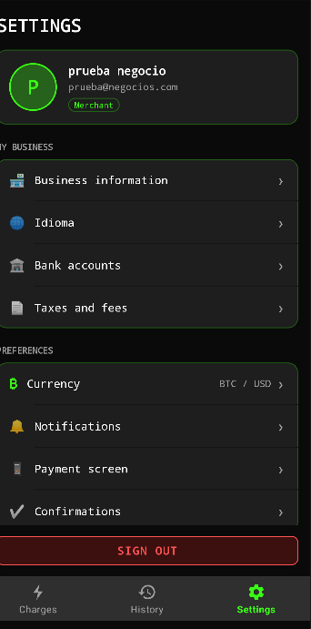
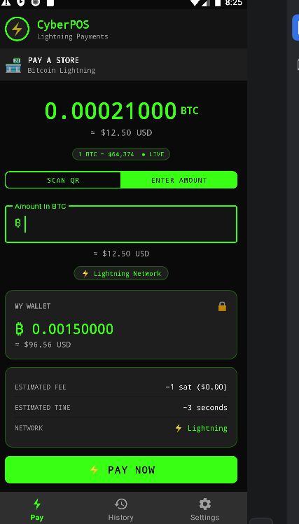
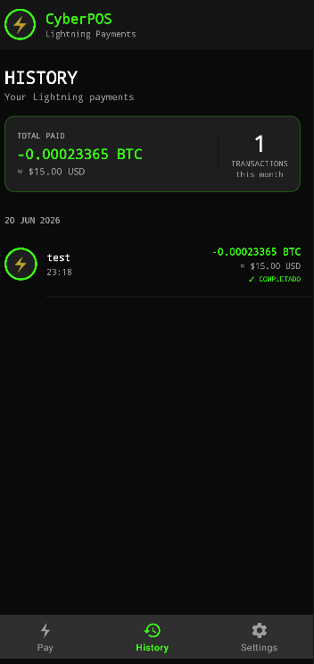
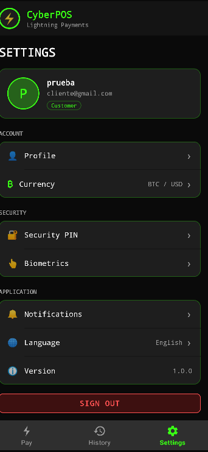

<div align="center">

# ⚡ CyberPOS

### Bitcoin POS para pequeños negocios en El Salvador

[](https://www.gnu.org/licenses/gpl-3.0)
[](https://android.com)
[](https://bitcoin.org)
[](https://btcpayserver.org)
[](https://github.com/DanielQuintanillaPaniagua/cyberpos-app)

> *"Don't trust, verify."* — código abierto, auditable, sin custodios.

**Lightning Payments para tu negocio | Hecho en El Salvador 🇸🇻**

</div>

---

## ¿Qué es CyberPOS?

CyberPOS es una aplicación Android de punto de venta (POS) para recibir pagos en Bitcoin — on-chain y Lightning Network — diseñada para pequeños negocios en El Salvador y Latinoamérica.

Sin intermediarios. Sin custodia. Sin KYC. Tus llaves, tu dinero.

Se conecta a **tu propio BTCPay Server** para generar facturas reales, mostrar el QR al cliente, y confirmar el pago automáticamente. El cliente paga con cualquier wallet Bitcoin (Muun, Phoenix, Blue Wallet, etc.).

---

## Screenshots

<div align="center">

| Login | Cobros (comerciante) | Historial (comerciante) |
|:-----:|:-------------------:|:----------------------:|
|  |  |  |

| Ajustes (comerciante) | Pago (cliente) | Historial (cliente) | Ajustes (cliente) |
|:--------------------:|:--------------:|:-------------------:|:-----------------:|
|  |  |  |  |

</div>

---

## Características

### Para el comerciante
- ⚡ Genera invoices reales vía **BTCPay Server API**
- 🔧 **Configuración de BTCPay desde la app** (URL, Store ID, API Key) — guardada cifrada en el dispositivo, nunca dentro del APK
- 📱 QR de pago en pantalla con precio BTC/USD en tiempo real (CoinGecko)
- ✅ Confirmación automática de pago por polling
- 🛒 Catálogo de productos con categorías, carrito, descuentos (por producto y global) e impuestos (IVA/ISR)
- 📦 Control de inventario (descuento de stock al cobrar)
- 💵 Pago mixto (efectivo + Bitcoin)
- 🎁 Puntos de lealtad y calificaciones del negocio
- 📊 Dashboard de analíticas con gráficos + **reportes PDF/CSV** con filtros por fecha
- 🖨️ **Impresión térmica Bluetooth** vía protocolo ESC/POS
- 📡 **NFC tap-to-pay** — el cliente acerca el teléfono y recibe el URI de pago
- 🎨 Personalización de la pantalla de cobro (logo, color, mensaje)
- 🔐 **Bloqueo biométrico** (huella/rostro) al abrir la app + PIN
- 🌍 Multiidioma: Español, English, Português, Français, Deutsch, Italiano

### Para el cliente
- 📷 Escanea el QR del comerciante con la cámara
- 💸 Abre tu wallet Bitcoin favorita para pagar
- 📋 Ve los detalles del invoice antes de pagar
- 📈 Historial de pagos + puntos de lealtad por comercio
- 🔒 Bloqueo biométrico, PIN, moneda de visualización y notificaciones configurables

---

## Stack técnico

| Componente | Tecnología |
|---|---|
| App | Android (Java), minSdk 26, targetSdk 34 |
| Auth | Firebase Authentication |
| Base de datos | Cloud Firestore |
| Pagos | BTCPay Server via REST API (`HttpURLConnection`) |
| Precio BTC | CoinGecko API (USD/EUR, en tiempo real) |
| QR | ZXing + zxing-android-embedded |
| Reportes | PDF nativo (`android.graphics.pdf.PdfDocument`) + CSV nativo |
| Impresión | ESCPOS-ThermalPrinter (Bluetooth ESC/POS) |
| Gráficos | MPAndroidChart |
| NFC | Android NFC API (HCE nativo) |
| Almacenamiento seguro | EncryptedSharedPreferences (AndroidX Security) |
| Biometría | AndroidX Biometric |

> Todas las dependencias de terceros son compatibles con GPL v3 (Apache 2.0 / MIT). Ver [`app/build.gradle`](app/build.gradle).

---

## ⚠️ Notas de seguridad (léelas antes de usar en producción)

CyberPOS es un cliente sin backend propio: habla directo con BTCPay y Firestore. Eso implica compromisos que debes conocer:

1. **La API key de BTCPay vive en el dispositivo del comerciante** (cifrada con Android Keystore vía `BtcPayConfig`). No se compila en el APK. Crea la key en tu BTCPay con el **permiso mínimo**: `btcpay.store.cancreateinvoice` + `btcpay.store.canviewinvoices`.
2. **Las reglas de Firestore son la única barrera de seguridad real** — todo el código corre en dispositivos que pueden manipularse. Están versionadas en [`firestore.rules`](firestore.rules); publícalas en tu proyecto antes de nada. Los compromisos conocidos del diseño sin backend están documentados en el encabezado de ese archivo.
3. **La confirmación de pago depende del polling del cliente**: si la app muere justo tras pagar, el pago puede quedar `pending`. Un backend con webhooks de BTCPay lo resolvería (ver [Roadmap](#roadmap)).

Reportes de vulnerabilidad: ver [SECURITY.md](SECURITY.md).

---

## Setup para desarrollo (modo demo / regtest)

### 1. Clonar

```bash
git clone https://github.com/DanielQuintanillaPaniagua/cyberpos-app.git
cd cyberpos-app
git checkout dev
```

### 2. Firebase

CyberPOS usa Firebase (Auth + Firestore). El `google-services.json` del repo apunta a un proyecto de ejemplo; **crea el tuyo** para no compartir base de datos:

1. Crea un proyecto en [console.firebase.google.com](https://console.firebase.google.com)
2. Añade una app Android con package `com.cyberpos.app`
3. Descarga tu `google-services.json` y reemplaza el de `app/`
4. Habilita **Authentication → Email/Password** y **Firestore Database**
5. En Firestore → Reglas, pega el contenido de [`firestore.rules`](firestore.rules) y publica

### 3. `local.properties`

No está en el repo (contiene credenciales). Créalo en la raíz:

```properties
sdk.dir=C:\\Users\\TU_USUARIO\\AppData\\Local\\Android\\Sdk
BTCPAY_API_KEY=tu_api_key_de_btcpay
BTCPAY_STORE_ID=tu_store_id
BTCPAY_URL=http://10.0.2.2:14142
```

> `local.properties` es un **fallback de desarrollo**. En la app real, cada comerciante configura su BTCPay en Ajustes → Servidor BTCPay. Para teléfono físico, reemplaza `10.0.2.2` por la IP local de tu PC.

### 4. BTCPay Server local (Docker)

```bash
cd C:\ruta\a\BTCPayServer
docker-compose up -d
```

Dashboard en `http://localhost:14142`.

### 5. Minar bloques iniciales en regtest ⚠️

Paso obligatorio: sin bloques minados BTCPay no procesa pagos en regtest.

```bash
# Dirección del wallet
docker exec btcpayserver-bitcoin-1 bitcoin-cli \
  -regtest -rpcuser=cyberpos -rpcpassword=cyberpos123 getnewaddress

# Minar 101 bloques (reemplaza <DIRECCION>)
docker exec btcpayserver-bitcoin-1 bitcoin-cli \
  -regtest -rpcuser=cyberpos -rpcpassword=cyberpos123 \
  generatetoaddress 101 <DIRECCION>
```

### 6. (Opcional) Actualizar IP automáticamente

Si tu IP local cambia entre sesiones, `actualizar-ip.ps1` detecta tu IP de Wi-Fi y actualiza `BTCPAY_URL` en `local.properties`.

### 7. Compilar

Abre el proyecto en Android Studio, sincroniza Gradle y corre en emulador o dispositivo. Desde terminal:

```bash
./gradlew assembleDebug        # compilar
./gradlew testDebugUnitTest    # tests unitarios
```

> El `network_security_config` permite HTTP en cleartext **solo en builds debug** (para BTCPay local sin TLS). Los builds de release exigen HTTPS.

---

## Arquitectura

Código Java en un único paquete `com.cyberpos.app` (más el subpaquete `model/`). Las clases se agrupan por convención de nombre:

```
app/src/main/java/com/cyberpos/app/
├── Activities de autenticación   → LoginActivity, RegisterActivity, MainActivity
├── Activities de comerciante     → CatalogoActivity, PaymentActivity, MerchantHistorialActivity,
│                                    MerchantAjustesActivity, GestionProductosActivity,
│                                    DashboardActivity, ReportesActivity, BtcPayConfigActivity, …
├── Activities de cliente         → CustomerHomeActivity, HistorialActivity, CustomerPerfilActivity, …
├── Servicios / helpers           → BtcPayClient, BtcPayConfig, PriceService, PrinterManager,
│                                    NfcHceService, BiometricLock, ReceiptGenerator, ReportExporter,
│                                    MoneyFormatter, CurrencyPref, RatingHelper, MerchantProfileHelper
├── Adapters                      → CartAdapter, ProductoAdapter, GestionProductosAdapter
└── model/                        → CartItem, CartTotals, Payment, Producto, Rating
```

**Puntos únicos (respétalos al contribuir):**
- `BtcPayClient` — único acceso a la API de BTCPay. Lee credenciales de `BtcPayConfig`.
- `CartTotals` — único cálculo del carrito (subtotal → descuento → impuestos → total).
- `MoneyFormatter` / `CurrencyPref` — único formateo y fuente de la moneda de visualización.
- `BiometricLock` — único candado biométrico local.

### Persistencia (Firestore)

```
users/{uid}                                  # role, email, businessName/fullName, createdAt
  ├── productos/{id}                         # catálogo (nombre, precioUsd, stock, descuento…)
  ├── cuentas_bancarias/{id}
  ├── negocio/datos                          # info pública del negocio (nombre, horario…)
  ├── perfil/datos
  ├── dispositivos/{id}
  └── configuracion/{doc}                    # pantalla_cobro, lealtad, moneda, notificaciones,
                                             #   impuestos, pin, biometria
payments/{id}                                # merchantId, payerUid, amountUsd, amountBtc, status,
                                             #   btcPayInvoiceId, cartItems, descuento, impuestos…
customers/{customerId}/puntos/{merchantId}   # puntos de lealtad
merchants/{merchantId}/ratings/{paymentId}   # calificaciones (una por pago)
```

Reglas de acceso: [`firestore.rules`](firestore.rules).

---

## Roadmap

- [x] Flujo de pago on-chain completo (BTCPay + regtest)
- [x] Historial de transacciones en tiempo real
- [x] Ajustes de comerciante y cliente
- [x] Multiidioma (6 idiomas)
- [x] Configuración de BTCPay desde la app (credenciales cifradas)
- [x] Reportes PDF/CSV, impresión térmica Bluetooth, NFC tap-to-pay
- [x] Catálogo, descuentos, impuestos, inventario, pago mixto, lealtad, calificaciones
- [x] Bloqueo biométrico local
- [x] Reglas de Firestore versionadas
- [ ] ⚡ Lightning Network real (LND)
- [ ] LNURL-pay — QR estático permanente
- [ ] Backend (Cloud Functions) + webhooks de BTCPay para confirmación server-side
- [ ] Migrar montos a enteros (centavos/satoshis) en vez de `double`
- [ ] TOTP (Google Authenticator) como 2FA de cuenta real

---

## Contribuir

El proyecto es **GPL v3** — libre de usar, modificar y redistribuir bajo los mismos términos. Lee [CONTRIBUTING.md](CONTRIBUTING.md) para el setup, la convención de commits y el proceso de PR. Reportá bugs en [GitHub Issues](https://github.com/DanielQuintanillaPaniagua/cyberpos-app/issues) y vulnerabilidades según [SECURITY.md](SECURITY.md).

---

## Licencia

```
CyberPOS — Bitcoin POS para pequeños negocios
Copyright (C) 2026 Daniel Quintanilla Paniagua

This program is free software: you can redistribute it and/or modify
it under the terms of the GNU General Public License as published by
the Free Software Foundation, either version 3 of the License, or
(at your option) any later version.
```

Licencia completa: [LICENSE](LICENSE) — GPL v3

---

<div align="center">

**⚡ Hecho en El Salvador 🇸🇻 con Bitcoin y código libre**

*Not your keys, not your coins.*

[GitHub](https://github.com/DanielQuintanillaPaniagua/cyberpos-app) · [Issues](https://github.com/DanielQuintanillaPaniagua/cyberpos-app/issues) · [GPL v3](https://www.gnu.org/licenses/gpl-3.0)

</div>
